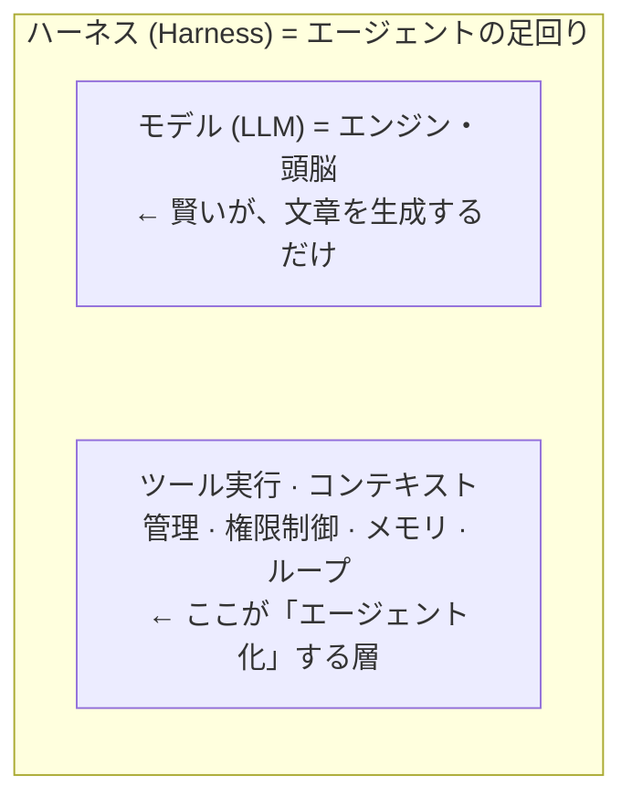

# AI エージェント / ハーネス 学習ガイド【教科書版】

> 作成日: 2026-06-04 / 更新: 2026-06-04(章ごとにファイル分割)
> 各章は「解説文 + 例コード + 課題」で構成。コード例は Python + Hugging Face の `huggingface_hub`(`InferenceClient`)を基本に、本質がわかる最小構成で示す(モデルは `Qwen/Qwen2.5-72B-Instruct` 等のオープンモデル)。

このフォルダは、AI エージェントとそのハーネス(足回り)を一から体系的に学ぶための教科書を、**章ごとにファイル分割**したものです。上から順に読むことを想定しています。

---

## 目次

| # | ファイル | テーマ | ゴール |
|---|---|---|---|
| 00 | [00_README.md](00_README.md) | はじめに・索引 | 読み方と全体像 |
| 01 | [01_フェーズ1_LLMの基礎.md](01_フェーズ1_LLMの基礎.md) | LLM の基礎 | なぜハーネスが必要かを腹落ちさせる |
| 02 | [02_フェーズ2_ReActループ.md](02_フェーズ2_ReActループ.md) | エージェントの中核ループ | ReAct ループを自分で書ける |
| 03 | [03_フェーズ3_ツール設計.md](03_フェーズ3_ツール設計.md) | ツール設計 | 良いツールと悪いツールを見分ける |
| 04 | [04_フェーズ4_コンテキストエンジニアリング.md](04_フェーズ4_コンテキストエンジニアリング.md) | コンテキスト工学 | context rot を防ぐ設計 |
| 05 | [05_フェーズ5_ハーネス9大構成要素.md](05_フェーズ5_ハーネス9大構成要素.md) | ハーネスの解剖図 | 9 大構成要素を描ける |
| 06 | [06_フェーズ6_ワークフローvsエージェント.md](06_フェーズ6_ワークフローvsエージェント.md) | WF vs エージェント | 5 パターンを使い分ける |
| 07 | [07_フェーズ7_評価安全運用.md](07_フェーズ7_評価安全運用.md) | 評価・安全・運用 | 安全に運用・評価する |
| 08 | [08_フェーズ8_フレームワーク.md](08_フェーズ8_フレームワーク.md) | フレームワークへ | 自作ループから卒業する |
| 09 | [09_フェーズ9_MCP.md](09_フェーズ9_MCP.md) | MCP | ツール接続の標準を使う |
| 10 | [10_フェーズ10_マルチエージェント.md](10_フェーズ10_マルチエージェント.md) | マルチエージェント | 複数エージェントを協調させる |
| 11 | [11_卒業後の道と参考文献.md](11_卒業後の道と参考文献.md) | 卒業後の道・出典 | 次に学ぶこと |
| 付A | [付録A_検索論争_grepとRAG.md](付録A_検索論争_grepとRAG.md) | 検索論争:grep vs RAG | エージェントが grep でベクトル検索を置き換えた理由を理解する |

---

## はじめに ── この教科書の読み方

AI エージェントを学ぶとき、多くの人は「ChatGPT のような賢い AI に、ツールを足したもの」という漠然としたイメージから始めます。しかしそれでは、なぜエージェントが時々おかしな動きをするのか、なぜ「コンテキスト管理」が大事なのかが理解できません。

この教科書は、**「モデル(頭脳)」と「ハーネス(足回り)」を明確に分けて理解する**ことを最大の方針とします。モデルは賢いが、文章を生成するだけの存在です。それを実際に「ファイルを読み、コマンドを実行し、複数ステップの仕事をこなす」エージェントに変えるのが、ハーネスという外側の層です。



各章は「解説 → 例コード → 課題」の順で進みます。**課題は必ず手を動かして解いてください**。エージェント開発は、読むだけでは絶対に身につきません。特にフェーズ 2 で「自分でエージェントのループを 1 本書く」ことが、この教科書全体で最も重要な経験になります。

### 学習順序

```
F1 LLM基礎 → F2 ReActループ自作(最重要) → F3 ツール設計 → F4 コンテキスト工学
   → F5 ハーネス9要素 → F6 WF/エージェント → F7 評価・安全・運用
   → F8 フレームワーク → F9 MCP → F10 マルチエージェント → 卒業
```

> 鉄則(全章共通):**まず素の API でループを書く → フレームワークは後**。「なぜそれが要るか」を体感してから抽象化に進む。

### コードの積み上がり方

コード例は章をまたいで積み上がります。フェーズ 2 の自作ループに、フェーズ 4 で compaction、フェーズ 5 でガードレールを足し、**フェーズ 7 の卒業課題で 1 つの `AgentHarness` に統合**、さらに**フェーズ 10 でマルチエージェント化**します。

### このプロジェクトを教材として使う

各章末の「プロジェクト連動」課題では、手元の実物 ── `CLAUDE.md` / `共通規約/` / `memory/` / Skill 群 / Workflow ツール / `mcp__*` ツール ── が、学んだ理論のどれに当たるかを自分で対応づけます。理論と実運用ハーネスを橋渡しする入口です。
