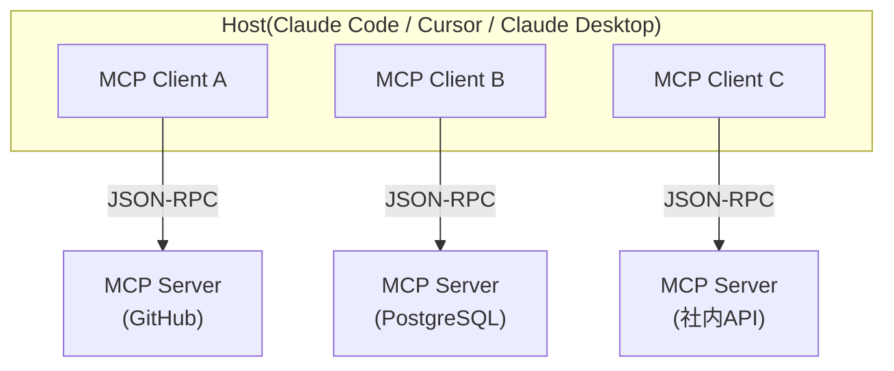

# フェーズ 9:MCP ── ツール接続の標準規格

> [← 08 フレームワークへ](08_フェーズ8_フレームワーク.md) ｜ [10 マルチエージェント →](10_フェーズ10_マルチエージェント.md)

## 9-1. 解説

### MCP とは ── 「AI の USB-C」

フェーズ 3 では、ツールを 1 つずつ手で定義しました。しかし現実には、GitHub・Slack・PostgreSQL・Stripe… と無数の外部サービスを繋ぎたい。サービスごと・フレームワークごとに繋ぎ方を書いていてはキリがありません。

**MCP(Model Context Protocol)** は、この「AI アプリ ↔ 外部ツール/データ」の接続を**標準化**するオープンプロトコルです。Anthropic が 2024 年 11 月に公開し、今や OpenAI・Google も対応する事実上の標準になりました。よく「**AI の USB-C**」と例えられます ── 一度 MCP サーバを作れば、MCP 対応のあらゆるクライアント(Claude Desktop・Claude Code・Cursor・VS Code…)から即座に使えるからです。

> 普及状況(2026 Q2):GitHub・Slack・PostgreSQL・Stripe・Figma・Docker・Kubernetes など 200 以上のコミュニティ製 MCP サーバが存在。Fortune 500 の約 28% が MCP サーバを AI スタックに導入済み。

### アーキテクチャ ── クライアント・サーバ型

MCP は **JSON-RPC 2.0** の上に構築されたクライアント・サーバ型です。



- **Host**:AI アプリ本体(複数の MCP クライアントセッションを束ねる)。
- **MCP Client**:1 サーバと 1:1 で繋がる、ステートフルな JSON-RPC チャネル。
- **MCP Server**:ツールやデータを「提供する側」。あなたが作る/既製を使う。

### MCP サーバが公開する 3 つのプリミティブ

| プリミティブ | 意味 | フェーズ 3・4 との対応 |
|---|---|---|
| **Tools(ツール)** | 副作用を伴う実行操作(DB 行挿入・メール送信・API 呼び出し) | フェーズ 3 のツールそのもの |
| **Resources(リソース)** | 読み取り専用のデータアクセス(ファイル内容・DB の中身) | フェーズ 4 の JIT retrieval の供給源 |
| **Prompts(プロンプト)** | ユーザのワークフローを導く定義済みテンプレート | 再利用可能な指示の部品 |

### トランスポート(通信方式)2 種

- **stdio**:ローカルのサブプロセスとして通信。デスクトップアプリや開発に最適。
- **HTTP / SSE(Streamable HTTP)**:リモートでスケーラブルな接続。クラウド配備・マイクロサービス向け。2026 はこの remote 化が production 普及を後押し(ただしステートフルセッションとロードバランサの相性など課題も残る)。

### このセッションとの関係

あなたが今いる環境には、すでに大量の MCP ツールが繋がっています。冒頭の「deferred tools」一覧 ── `mcp__Claude_in_Chrome__*`(ブラウザ操作)、`mcp__scheduled-tasks__*`(スケジュール)、`mcp__ccd_session__*`(セッション管理)など ── は**すべて MCP サーバ経由のツール**です。`mcp__<サーバ名>__<ツール名>` という命名は、フェーズ 3 で学んだ namespacing の実例でもあります。

## 9-2. 例コード ── 最小の MCP サーバを作る

Python の公式 SDK(`mcp`)で、フェーズ 3 の「ファイル読み込み(read_file)」を MCP サーバとして公開します。

```python
# pip install mcp
# server.py ── ファイル読み込みを提供する MCP サーバ
from mcp.server.fastmcp import FastMCP

mcp = FastMCP("fileutil-server")

@mcp.tool()                              # ← Tools プリミティブ
def read_file(path: str) -> str:
    """指定パスのテキストファイルを読んで内容を返す。"""
    with open(path, encoding="utf-8") as f:
        return f.read()

@mcp.resource("config://version")        # ← Resources プリミティブ(読み取り専用)
def version() -> str:
    """このサーバのバージョンを返す。"""
    return "1.0.0"

if __name__ == "__main__":
    mcp.run(transport="stdio")            # ← stdio トランスポートで起動
```

これを Claude Desktop / Claude Code の設定ファイルに登録すると、即座にツールとして使えます(イメージ):

```json
{
  "mcpServers": {
    "fileutil": {
      "command": "python",
      "args": ["C:/path/to/server.py"]
    }
  }
}
```

登録後、AI 側からは `read_file` ツールが見えるようになり、フェーズ 3 で手で定義したのと同じように呼び出せます ── ただし**今後どのクライアントからでも再利用できる**点が決定的に違います。

## 9-3. 課題

1. **【理解】** 「AI の USB-C」という比喩が何を意味するか、フェーズ 3 で 1 つずつツールを定義した経験と対比して説明せよ。
2. **【識別】** このセッションの deferred tools 一覧から、MCP 経由のツールを 5 つ挙げ、`mcp__<サーバ名>__<ツール名>` のサーバ名部分を抽出せよ。namespacing(フェーズ 3)がどう機能しているか述べよ。
3. **【設計】** Tools・Resources・Prompts の 3 プリミティブそれぞれに、具体例を 2 つずつ考えよ。「天気予報を取得」「会社の就業規則を参照」「コードレビュー用テンプレート」はそれぞれどれに当たるか。
4. **【実装】** 上の `server.py` を実際に動かし、`list_files` ツールと「現在時刻を返す resource」を追加せよ。可能なら Claude Desktop か Cursor に登録して呼び出せ。
5. **【発展】** stdio と HTTP トランスポートの使い分けを、ローカル開発とクラウド配備の観点で説明せよ。remote MCP をスケールさせるときの課題(ステートフルセッション × ロードバランサ)を述べよ。
6. **【プロジェクト連動】** もしこの調達 PoC の「業務 SQL を検索する MCP サーバ」を作るとしたら、Tools・Resources・Prompts に何を割り当てるか設計せよ(ヒント:SQL 実行=Tool、`棚卸し.md` 参照=Resource、行マッピングコメント生成=Prompt)。

---

> [← 08 フレームワークへ](08_フェーズ8_フレームワーク.md) ｜ [10 マルチエージェント →](10_フェーズ10_マルチエージェント.md)
