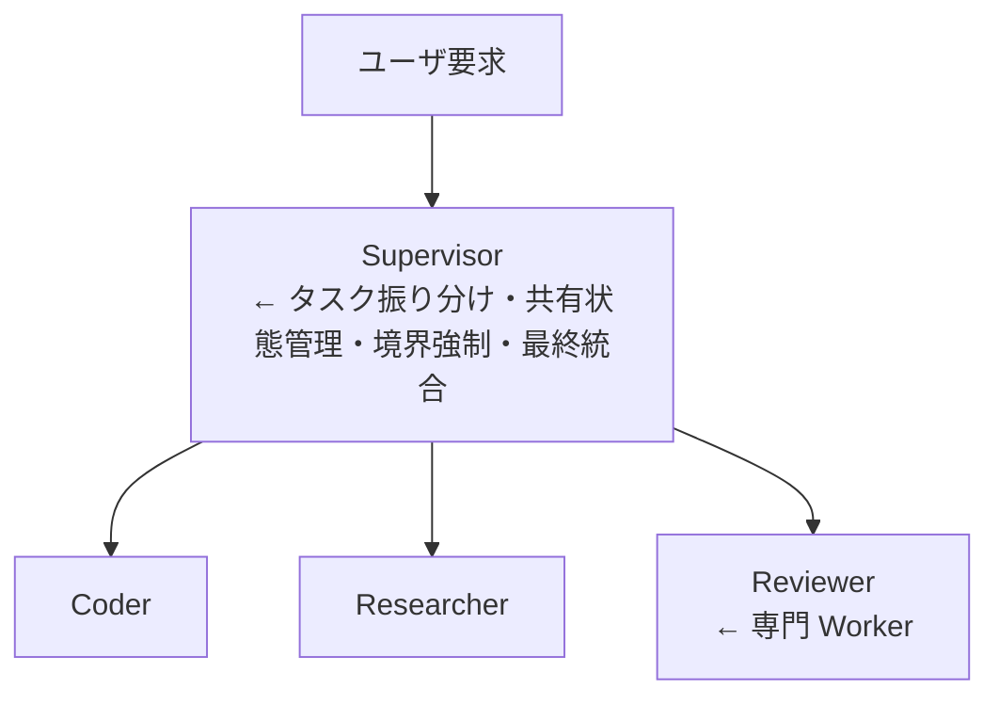
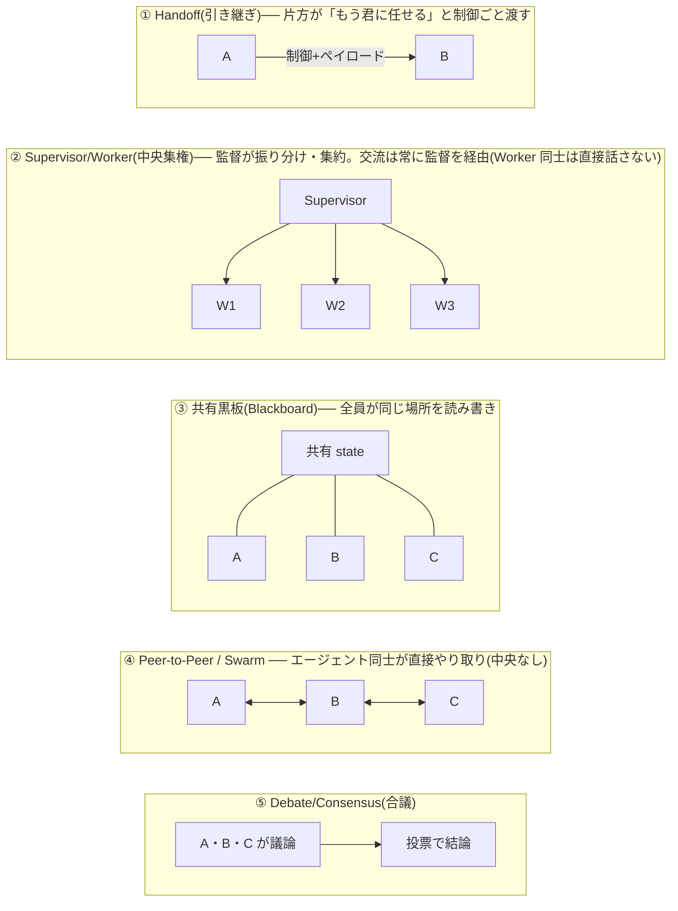

# フェーズ 10:マルチエージェント ── 複数エージェントの協調

> [← 09 MCP](09_フェーズ9_MCP.md) ｜ [11 卒業後の道と参考文献 →](11_卒業後の道と参考文献.md)

フェーズ 6 でワークフローの 5 パターンに触れました。フェーズ 10 では、**複数の自律エージェントを協調させる**設計を深掘りします。1 つのエージェントに全部やらせるより、専門エージェントに分けた方が、適切に組めば **12〜23% の性能向上**が報告されています。

## 10-1. 解説

### まず鉄則:分けすぎるな

> 「ワークフローの名詞ごとにエージェントを作りたくなるが、抵抗せよ。1 つのよく計装されたエージェントで済むなら、それが大抵より良い production システムである。」

マルチエージェントは強力ですが、エージェントが増えるほど協調コスト・レイテンシ・デバッグ難度が上がります。**単一エージェントで明確に足りないときだけ**分割する ── フェーズ 6 の「まずシンプルに」の延長です。

### 6 つのオーケストレーションパターン(2026 production 実証)

| パターン | 内容 | 向くケース |
|---|---|---|
| **1. Sequential Chains(逐次連鎖)** | エージェントを一列に繋ぐ | 段階が固定的なパイプライン |
| **2. Parallel Fan-out(並列展開)** | 同時に複数エージェントへ展開 | 独立タスクの同時処理・多視点 |
| **3. Supervisor/Worker(監督役/作業役)** | 監督が作業役にタスクを振り分け、結果を集約 | **2026 の production 既定**。coder + researcher + reviewer など |
| **4. Hierarchical Delegation(階層委譲)** | 監督の下にさらに監督…の多層 | 大規模で階層的な問題 |
| **5. Consensus/Debate(合議/討論)** | 複数エージェントが議論・投票して結論 | 高い確信度が要る判断 |
| **6. Human-in-the-loop(人間介在)** | 要所で人間が承認・修正 | 高リスク・不可逆な操作 |

> **迷ったら Supervisor から**。coder + researcher + reviewer のようなクロスドメインタスクの正しい出発点。そこから fan-out や swarm へ拡張する。

### Supervisor パターンの構造



Supervisor の仕事は 4 つ:**タスクを振り分ける / 共有状態を管理する / 境界を強制する / 最終出力を組み立てる**。

### Handoff(引き継ぎ)と A2A

- **Handoff**:あるエージェントが別エージェントへ、構造化されたペイロードと共に制御を渡す。OpenAI Agents SDK では一級プリミティブで、遷移を記録してリプレイ可能。
- **A2A(Agent2Agent)**:Google が 2025 年 4 月に出したエージェント間連携の標準。**MCP がツール接続の標準なら、A2A はエージェント連携の標準**。ベンダー中立で、CrewAI のエージェントが Hugging Face モデルのサブエージェントに委譲し、それが別の critic を呼ぶ、といった異種混在が可能になる。A2A が定めるのは「エージェント発見(discovery)・タスクのライフサイクル・構造化された handoff」。

### エージェント間の交流(通信)はどの形で行うか

マルチエージェントの「交流」は、**①何を交換するか(中身)/ ②どう繋ぐか(トポロジー)/ ③どんな規格で(プロトコル)** の 3 層で整理できます。

#### ① やり取りの「中身」── 何を交換するか

| 形式 | 内容 | 具体例 |
|---|---|---|
| **テキスト/メッセージ** | 自然言語で結果や指示を渡す | 「調査結果はこうだった」を文章で次へ渡す |
| **構造化ペイロード** | JSON など決まった形式でデータを渡す | `{"findings": [...], "status": "done"}` |
| **共有状態(shared state)** | 共通の「黒板」を全員が読み書き | Supervisor が持つ `context` 変数、共有メモリ |
| **ファイル/成果物** | ディスク上のファイルを介して受け渡す | エージェント A が書いたコードを B が読む |

> 重要原則(フェーズ 4 の sub-agent):**子エージェントは詳細ではなく「要約」だけを返す**。全部を親に返すとコンテキストが膨張するため。

#### ② 繋ぎ方の「形(トポロジー)」── どう連携するか



**2026 の production 既定は ② Supervisor/Worker**。交流が必ず監督を通るので、状態管理・境界の強制・デバッグが容易だから。迷ったらこれが出発点。

#### ③ 通信の「規格」── プロトコル層

| 規格 | 役割 | 一言で |
|---|---|---|
| **MCP**(フェーズ 9) | AI ↔ ツール/データ の接続 | 「ツール接続の標準」 |
| **A2A(Agent2Agent)** | エージェント ↔ エージェント の連携 | 「エージェント連携の標準」 |

#### 交流の「実体」はプロンプトへの差し込み

派手に見えても、実装レベルでの交流の本質は **「あるエージェントの出力(テキスト/JSON)を、次のエージェントの入力プロンプトに差し込む」** だけです。下の Supervisor の例(10-2)では、交流はこの 3 行に集約されています。

```python
task = f"{step['task']}\n\nこれまでの成果:\n{context}"   # ← 共有状態を「渡す」
result = worker(task)                                    # ← 結果を「受け取る」
context += f"\n\n【{step['worker']}の結果】\n{result}"    # ← 黒板に「書き戻す」
```

つまり「受け渡しの連結」がマルチエージェントの交流の正体です。

### 落とし穴(production の現実)

- **Supervisor がボトルネック・単一障害点になる**。対策:ルーティング判断のキャッシュ、ルーターに小型・高速モデルを使う、ルーティングの振動(oscillation)に circuit breaker を入れる。
- **エージェント間でコンテキストが膨らむ**。対策:子は要約だけ返す(フェーズ 4 の sub-agent)。

## 10-2. 例コード ── Supervisor パターンの最小実装

フェーズ 6 の `ask()` ヘルパを使い、Supervisor が 3 つの専門 Worker を束ねます。

```python
import json
# ask() はフェーズ6と同じ「1回の素のモデル呼び出し」ヘルパ

# Worker:それぞれ専門の指示を持つ
def researcher(task):
    return ask(f"あなたは調査担当。次を事実ベースで調査し要点を箇条書き:\n{task}")

def coder(task):
    return ask(f"あなたは実装担当。次の要件を満たすコードを書け:\n{task}")

def reviewer(artifact):
    return ask(f"あなたはレビュー担当。次を批判的にレビューし問題点を挙げよ:\n{artifact}")

WORKERS = {"research": researcher, "code": coder, "review": reviewer}

# Supervisor:タスクを分解・振り分け・集約する
def supervisor(user_request):
    # ① 振り分け計画(どの worker をどの順で使うか)を立てる
    plan_json = ask(
        f"次の要求を達成する手順を JSON 配列で。各要素は "
        f'{{"worker":"research|code|review","task":"..."}}:\n{user_request}'
    )
    plan = json.loads(plan_json)

    # ② 順に worker を実行し、結果を共有状態(context)に蓄積
    context = ""
    for step in plan:
        worker = WORKERS[step["worker"]]
        task = f"{step['task']}\n\nこれまでの成果:\n{context}"   # 共有状態を渡す
        result = worker(task)
        print(f"  🤝 {step['worker']} 実行")
        context += f"\n\n【{step['worker']} の結果】\n{result}"

    # ③ 最終統合
    return ask(f"次の作業結果を統合し、最終成果物にまとめよ:\n{context}")

# 実行例
print(supervisor("Python で素数判定関数を作り、レビューして改善版を出して"))
```

並列展開(fan-out)にしたい部分は、フェーズ 6 の `ThreadPoolExecutor` で `parallel` 化できます。Consensus/Debate なら、複数 Worker に同じ問いを投げて `vote()`(フェーズ 6)で多数決を取ります。

### このセッションの Workflow ツールとの対応

このセッションの **Workflow ツール**は、まさにこのパターン群の実装です:

- `pipeline(items, stage1, stage2, ...)` = Sequential Chains(barrier なしで各アイテムが独立に流れる)
- `parallel(thunks)` = Parallel Fan-out(barrier 付き、全部待つ)
- スクリプト本体で分解 → `agent()` 委譲 → 結果集約 = Supervisor/Worker
- `agent()` の `schema` で構造化出力を強制 = Handoff の構造化ペイロード

## 10-3. 課題

1. **【判断】** 次のどれを単一エージェントで、どれをマルチエージェントでやるべきか、「分けすぎるな」の原則に照らして判断せよ:(a) 1 ファイルの誤字修正 (b) 新機能の調査・実装・レビュー (c) 100 ファイルのセキュリティ監査。
2. **【実装】** 上の `supervisor` を動かし、`plan` にどんな手順が生成されるか観察せよ。Worker を 1 つ追加(例:`tester`)して plan に組み込まれるか試せ。
3. **【設計】** 6 パターンそれぞれに具体的なユースケースを 1 つずつ割り当てよ。「複数の翻訳案から最良を選ぶ」「コードを書いてテストしてレビューする」はそれぞれどのパターンか。
4. **【トラブル対応】** Supervisor が単一障害点・ボトルネックになる問題に対し、講義で挙げた 3 つの対策(キャッシュ・小型ルーター・circuit breaker)がそれぞれ何を解決するか説明せよ。
5. **【標準理解】** MCP と A2A の違いと関係を 1 文で説明せよ(ヒント:MCP は ___ の標準、A2A は ___ の標準)。
5b. **【交流の形】** エージェント間の交流の「中身」4 種(テキスト/構造化JSON/共有状態/ファイル)と「トポロジー」5 種(Handoff/Supervisor/共有黒板/P2P/合議)を挙げ、10-2 の Supervisor 実装がそれぞれどれを使っているか特定せよ。また「Worker 同士が直接話さない」のが Supervisor 型の利点である理由を述べよ。
6. **【プロジェクト連動】** このセッションの Workflow ツールのドキュメントにある「review-changes(dimensions → find → adversarially verify)」の例が、6 パターンのどれの組み合わせか分析せよ。`pipeline` と `parallel` がそれぞれどのパターンに対応するか述べよ。
7. **【総合・発展】** フェーズ 7 の卒業課題で作った単一エージェントを、Supervisor パターンに発展させよ。「フォルダ調査 → 要約 → 品質レビュー → 改善」を researcher / summarizer / reviewer の 3 役で分担し、単一版と品質・コスト・レイテンシを比較せよ。

---

> [← 09 MCP](09_フェーズ9_MCP.md) ｜ [11 卒業後の道と参考文献 →](11_卒業後の道と参考文献.md)
