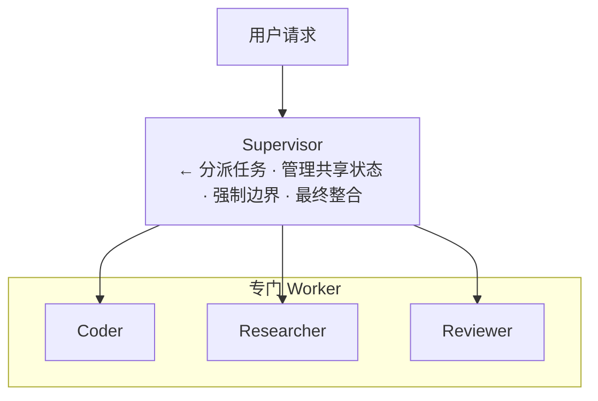
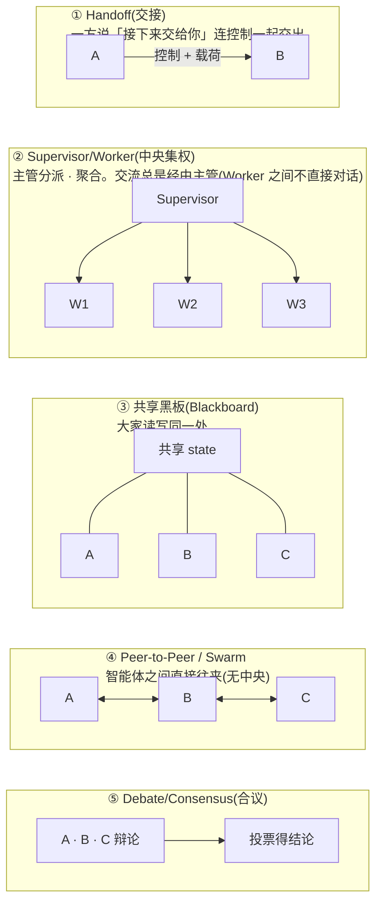

# 阶段 10:多智能体 ── 多个智能体的协作

> [← 09 MCP](09_阶段9_MCP.md) ｜ [11 毕业之路与参考文献 →](11_毕业之路与参考文献.md)

阶段 6 触及了工作流的 5 种模式。阶段 10 中,深入**让多个自主智能体协作**的设计。比起让一个智能体包揽,分成专门智能体若组合得当,据报告可带来 **12~23% 的性能提升**。

## 10-1. 讲解

### 首先是铁律:别拆过头

> 「会忍不住为工作流里的每个名词都造一个智能体,但要克制。若一个精心配备的智能体能搞定,那通常才是更好的 production 系统。」

多智能体很强大,但智能体越多,协作成本·延迟·调试难度越高。**只在单智能体明显不够时**才拆分 ── 这是阶段 6「先简单」的延续。

### 6 种编排模式(2026 production 实证)

| 模式 | 内容 | 适用 |
|---|---|---|
| **1. Sequential Chains(顺序串联)** | 把智能体排成一列 | 阶段固定的流水线 |
| **2. Parallel Fan-out(并行扇出)** | 同时向多个智能体扇出 | 独立任务并行·多视角 |
| **3. Supervisor/Worker(主管/工人)** | 主管分派任务给工人并聚合结果 | **2026 production 默认**。coder + researcher + reviewer 等 |
| **4. Hierarchical Delegation(分层委派)** | 主管之下再设主管…的多层 | 大规模、分层的问题 |
| **5. Consensus/Debate(共识/辩论)** | 多个智能体辩论·投票得出结论 | 需高置信度的判断 |
| **6. Human-in-the-loop(人类介入)** | 关键处由人审批·修改 | 高风险·不可逆操作 |

> **拿不准就从 Supervisor 开始**。它是 coder + researcher + reviewer 这类跨领域任务的正确起点,再从此扩展到 fan-out 或 swarm。

### Supervisor 模式的结构



Supervisor 的工作有 4 项:**分派任务 / 管理共享状态 / 强制边界 / 组装最终输出**。

### Handoff(交接)与 A2A

- **Handoff**:某智能体携带结构化载荷把控制交给另一智能体。在 OpenAI Agents SDK 中是一等原语,记录转移、可回放。
- **A2A(Agent2Agent)**:Google 于 2025 年 4 月发布的智能体间联动标准。**若 MCP 是工具连接的标准,A2A 就是智能体联动的标准**。厂商中立,使得 CrewAI 的智能体委派给使用 Hugging Face 模型的子智能体、再调用另一家的 critic 这种异构混合成为可能。A2A 规定的是「智能体发现(discovery)·任务生命周期·结构化 handoff」。

### 智能体间的「交流(通信)」以何种形式进行

多智能体的「交流」可按 **①交换什么(内容)/ ②如何连接(拓扑)/ ③用什么标准(协议)** 三层来梳理。

#### ① 交换的「内容」── 交换什么

| 形式 | 内容 | 具体例 |
|---|---|---|
| **文本/消息** | 用自然语言传递结果或指令 | 把「调查结果如此」用文字传给下一个 |
| **结构化载荷** | 用 JSON 等固定格式传数据 | `{"findings": [...], "status": "done"}` |
| **共享状态(shared state)** | 大家读写同一块「黑板」 | Supervisor 持有的 `context` 变量、共享内存 |
| **文件/产物** | 经磁盘文件交接 | 智能体 A 写的代码由 B 读取 |

> 重要原则(阶段 4 的 sub-agent):**子智能体只返回「总结」而非细节**。全部返给父智能体会让上下文膨胀。

#### ② 连接的「形(拓扑)」── 如何协作



**2026 production 默认是 ② Supervisor/Worker**。因为交流必经主管,状态管理·边界强制·调试都更容易。拿不准就从这里出发。

#### ③ 通信的「标准」── 协议层

| 标准 | 作用 | 一句话 |
|---|---|---|
| **MCP**(阶段 9) | AI ↔ 工具/数据 的连接 | 「工具连接的标准」 |
| **A2A(Agent2Agent)** | 智能体 ↔ 智能体 的联动 | 「智能体联动的标准」 |

#### 交流的「实体」就是往 prompt 里塞入

看着花哨,实现层面交流的本质不过是 **「把某智能体的输出(文本/JSON)塞进下一个智能体的输入 prompt」**。在下面 Supervisor 的例子(10-2)中,交流就集中在这 3 行:

```python
task = f"{step['task']}\n\n至今为止的成果:\n{context}"   # ← 「传递」共享状态
result = worker(task)                                    # ← 「接收」结果
context += f"\n\n【{step['worker']}的结果】\n{result}"    # ← 「写回」黑板
```

即「传递的串接」就是多智能体交流的真身。

### 陷阱(production 的现实)

- **Supervisor 成为瓶颈·单点故障**。对策:缓存路由判断、路由器用小而快的模型、对路由振荡(oscillation)加 circuit breaker。
- **智能体之间上下文膨胀**。对策:子智能体只返回总结(阶段 4 的 sub-agent)。

## 10-2. 示例代码 ── Supervisor 模式的最小实现

用阶段 6 的 `ask()` 辅助函数,Supervisor 统领 3 个专门 Worker。

```python
import json
# ask() 与阶段6相同,「单次裸模型调用」的辅助函数

# Worker:各自带专门指令
def researcher(task):
    return ask(f"你是调查员。请基于事实调查下面并用要点列出:\n{task}")

def coder(task):
    return ask(f"你是实现者。请写出满足下面需求的代码:\n{task}")

def reviewer(artifact):
    return ask(f"你是评审员。请批判性评审下面并指出问题:\n{artifact}")

WORKERS = {"research": researcher, "code": coder, "review": reviewer}

# Supervisor:分解·分派·聚合任务
def supervisor(user_request):
    # ① 制定分派计划(用哪些 worker、按什么顺序)
    plan_json = ask(
        f"把下面请求达成的步骤用 JSON 数组给出。每个元素为 "
        f'{{"worker":"research|code|review","task":"..."}}:\n{user_request}'
    )
    plan = json.loads(plan_json)

    # ② 依次执行 worker,把结果累积到共享状态(context)
    context = ""
    for step in plan:
        worker = WORKERS[step["worker"]]
        task = f"{step['task']}\n\n至今为止的成果:\n{context}"   # 传入共享状态
        result = worker(task)
        print(f"  🤝 执行 {step['worker']}")
        context += f"\n\n【{step['worker']}的结果】\n{result}"

    # ③ 最终整合
    return ask(f"整合下面的工作结果,做成最终成果物:\n{context}")

# 运行示例
print(supervisor("用 Python 写一个素数判定函数,评审后给出改进版"))
```

想做并行扇出(fan-out)的部分,可用阶段 6 的 `ThreadPoolExecutor` 来 `parallel` 化。Consensus/Debate 则向多个 Worker 投同一问题、用 `vote()`(阶段 6)做多数表决。

### 与本会话 Workflow 工具的对应

本会话的 **Workflow 工具**正是这套模式群的实现:

- `pipeline(items, stage1, stage2, ...)` = Sequential Chains(无 barrier,各 item 独立流动)
- `parallel(thunks)` = Parallel Fan-out(带 barrier,全部等待)
- 脚本主体中分解 → `agent()` 委派 → 聚合结果 = Supervisor/Worker
- `agent()` 的 `schema` 强制结构化输出 = Handoff 的结构化载荷

## 10-3. 练习

1. **【判断】** 以下哪些该用单智能体、哪些该用多智能体,按「别拆过头」原则判断:(a) 修改 1 个文件的错别字 (b) 新功能的调查·实现·评审 (c) 100 个文件的安全审计。
2. **【实现】** 运行上面的 `supervisor`,观察 `plan` 生成了怎样的步骤。增加 1 个 Worker(如 `tester`),试试它是否被纳入 plan。
3. **【设计】** 为 6 种模式各指派 1 个具体用例。「从多个翻译稿中选最佳」「写代码并测试并评审」分别属于哪种模式?
4. **【排障】** 针对 Supervisor 成为单点故障·瓶颈的问题,说明讲义所举的 3 个对策(缓存·小型路由器·circuit breaker)各解决什么。
5. **【标准理解】** 用一句话说明 MCP 与 A2A 的区别与关系(提示:MCP 是 ___ 的标准,A2A 是 ___ 的标准)。
5b. **【交流形式】** 列出智能体间交流的「内容」4 种(文本/结构化JSON/共享状态/文件)与「拓扑」5 种(Handoff/Supervisor/共享黑板/P2P/合议),并指出 10-2 的 Supervisor 实现各用了哪些。再说明「Worker 之间不直接对话」为何是 Supervisor 型的优点。
6. **【项目联动】** 分析本会话 Workflow 工具文档中「review-changes(dimensions → find → adversarially verify)」的例子是 6 种模式中哪些的组合。说明 `pipeline` 与 `parallel` 各对应哪种模式。
7. **【综合·进阶】** 把阶段 7 毕业练习做的单智能体发展为 Supervisor 模式。让「文件夹调查 → 总结 → 质量评审 → 改进」由 researcher / summarizer / reviewer 三角色分担,与单智能体版比较质量·成本·延迟。

---

> [← 09 MCP](09_阶段9_MCP.md) ｜ [11 毕业之路与参考文献 →](11_毕业之路与参考文献.md)
