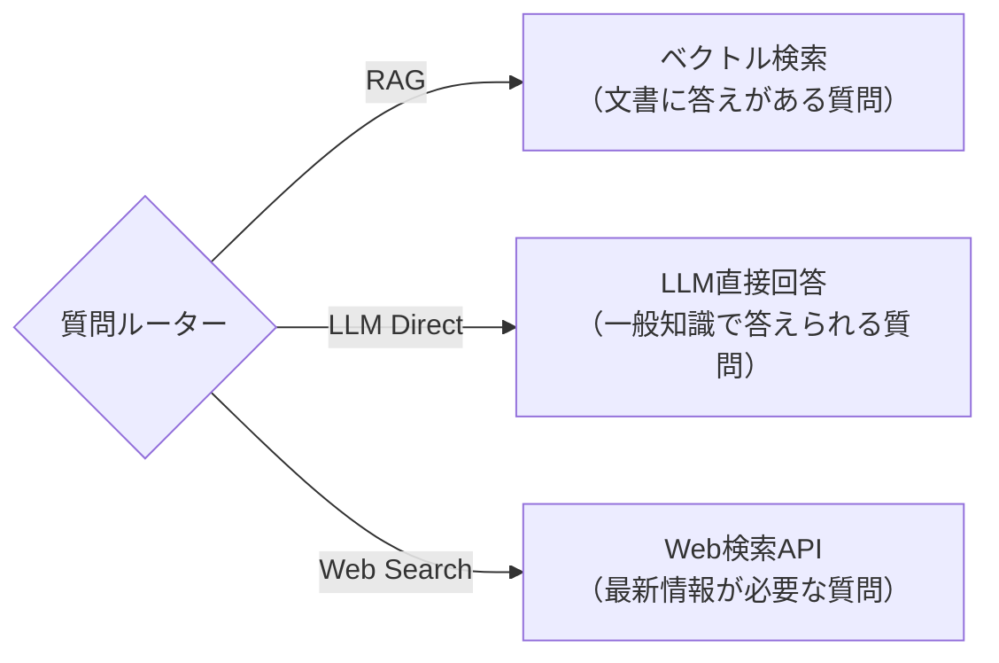

# 1-8. Adaptive RAG — 学習ノート

## 概念

すべての質問にRAG検索を使うのは無駄。質問の種類に応じてルーティングする。

## 3つのルーティング先

| ルート | いつ使う | 例 |
|---|---|---|
| **RAG** | 社内文書・プロジェクト固有の情報 | 「設計ドキュメントの認証フローは？」 |
| **LLM直接** | 一般的な知識で答えられる | 「Pythonのリスト内包表記は？」 |
| **Web検索** | 最新情報・リアルタイムデータ | 「2026年のPython最新バージョンは？」 |

## なぜ必要か

- **コスト削減**: 不要な検索を省くことでAPI呼び出し・トークンを節約
- **レイテンシ改善**: 検索不要な質問は即座に回答できる
- **精度向上**: 一般知識の質問にRAGを使うと、無関係な文書がノイズになって回答が悪化する場合がある

## 実装方法

### ルールベース（シンプル版）
- キーワードでルーティング（「最新」→Web、「仕様」→RAG）
- 実装が簡単だが、曖昧な質問に対応できない

### LLMベース（本番版）
- LLMにStructured Outputで分類させる（Pydanticでスキーマ定義）
- LangGraphのConditional Edgeとして組み込む（Phase 2で学ぶ）

## 実験結果

> 実行して結果を記入する

## Phase 2への橋渡し

- Adaptive RAGのルーターは、LangGraphの**Conditional Edge（条件分岐）**として実装する
- ルーティング結果に応じて異なるノード（検索、直接回答、Web検索）に遷移する
- これがPhase 2-1（LangGraph基礎）の出発点になる

## 使ったコード

- [adaptive_rag.py](adaptive_rag.py) — ルールベースルーター + LLM版のコメント付きコード
