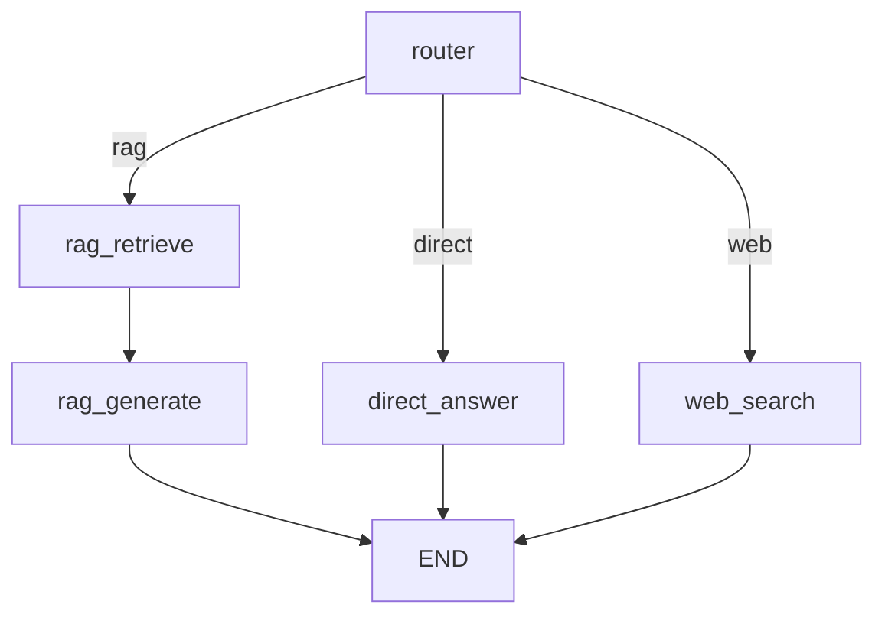

# 2-1. LangGraph 基礎 — 学習ノート

## 概念

LangGraphは**状態管理付きのグラフ構造**でエージェントのワークフローを組むフレームワーク。

## 4つの核心概念

### 1. State（状態）
- グラフ全体で共有されるデータ
- `TypedDict` で定義する
- 各ノードがStateを読み書きする

```python
class AgentState(TypedDict):
    query: str      # 入力
    route: str      # 中間状態
    answer: str     # 出力
```

### 2. Node（ノード）
- 状態を受け取り、処理して、更新部分を返す関数
- 戻り値はStateの一部（更新したいフィールドだけ返せばよい）

```python
def my_node(state: AgentState) -> dict:
    return {"answer": "処理結果"}
```

### 3. Edge（エッジ）
- ノード間の固定接続（A → B は常にBに進む）

```python
workflow.add_edge("retrieve", "generate")
```

### 4. Conditional Edge（条件分岐）
- 状態に応じて動的に次のノードを決める
- ルーティングの核心

```python
workflow.add_conditional_edges(
    "router",
    route_decision,     # 状態を見て文字列を返す関数
    {
        "rag": "retrieve",
        "direct": "generate",
    }
)
```

## グラフ構造の可視化



## 実験結果

> 実行して結果を記入する

## なぜLangGraphか

- **Chain（直線的）→ Graph（分岐・ループ）** への進化
- LangChainのChainは A→B→C の直線しか作れない
- LangGraphは分岐（Conditional Edge）とループ（Back Edge）が作れる
- エージェントの「判断→実行→評価→再試行」はグラフ構造でしか表現できない

## Phase 1 との接続

- 1-8 Adaptive RAG のルーターを LangGraph の Conditional Edge として実装した
- これが Phase 2 の全てのベースになる

## 使ったコード

- [langgraph_basics.py](langgraph_basics.py) — Adaptive RAGをLangGraphで実装
